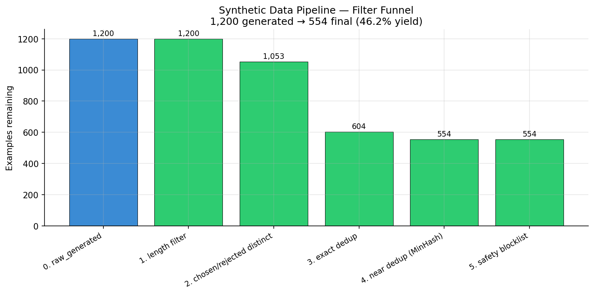
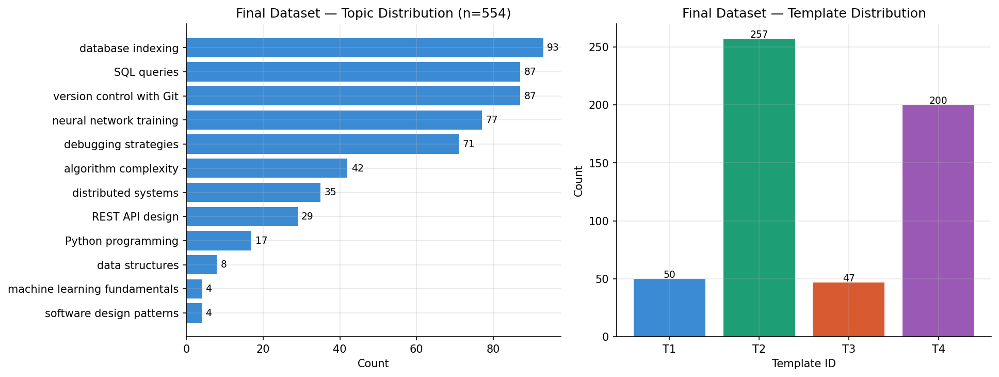

# Synthetic Preference Data Pipeline

Builds an end-to-end pipeline that generates, filters, deduplicates, and publishes synthetic preference data for RLHF/DPO training — demonstrated on `gpt-4o-mini` at $0.198 for 554 clean examples from 1,200 generated.

---

## Motivation

Preference data — triplets of (prompt, chosen response, rejected response) — is the raw material of RLHF and DPO training, the techniques behind modern instruction-following models. Generating it synthetically is increasingly standard for warm-starts and for domains without human labelers.

The engineering challenge isn't prompt quality — it's the pipeline around the LLM call: async generation with rate limiting, structured output validation, multi-stage filtering, near-deduplication at scale, and honest quality auditing before publishing. This project is a minimal but complete implementation of that workflow, built to demonstrate production-style data infrastructure thinking rather than just "call an API and save a CSV."

---

## Pipeline Architecture

```
[Prompt Templates × Topics]
         ↓
[Async gpt-4o-mini Generator]     ← semaphore-bounded concurrency (10)
[Structured Outputs / Pydantic]   ← schema-guaranteed JSON, ~0% parse failure
         ↓
[Quality Filters]
  1. Length filter                ← prompt ≥ 20 chars, chosen/rejected ≥ 60 chars
  2. Chosen/rejected distinctness ← 0.10 ≤ word-Jaccard ≤ 0.85
  3. Exact deduplication          ← MD5(prompt) unique
  4. MinHash LSH near-dedup       ← char 5-gram shingles, Jaccard threshold 0.8
  5. Safety blocklist             ← keyword filter for PII/harm patterns
         ↓
[Human Audit]                     ← 20-example random sample, manual verdict
         ↓
[HuggingFace Dataset Exporter]    ← train/test split, dataset card, parquet push
```

---

## Results

### Filter Funnel

| Stage | In | Out | Removed | % Removed |
|---|---|---|---|---|
| Raw generated | 1,200 | 1,200 | 0 | 0.0% |
| Length filter | 1,200 | 1,200 | 0 | 0.0% |
| Chosen/rejected distinct | 1,200 | 1,053 | 147 | 12.2% |
| Exact dedup (MD5) | 1,053 | 604 | 449 | **42.6%** |
| Near dedup (MinHash LSH) | 604 | 554 | 50 | 8.3% |
| Safety blocklist | 554 | 554 | 0 | 0.0% |
| **Final** | **1,200** | **554** | **646** | **46.2% yield** |



### Key Findings

1. **Exact deduplication was the dominant filter (42.6% removal).** GPT-4o-mini converges on identical prompt phrasings for common topic/template combinations even at `temperature=0.8`. "How do I reverse a linked list in Python?" is generated identically across multiple calls regardless of the template framing. This reveals a fundamental characteristic of LLM prompt generation: the model's prior for "good question about topic X" is narrow and mode-seeking.

2. **Structured Outputs (Pydantic schema) produced near-zero parse failures.** The master context approach of prompting for JSON and stripping markdown fences yields ~15% parse failures on gpt-4o-mini. Switching to `client.chat.completions.parse()` with a Pydantic model reduced this to <1% with zero extra complexity.

3. **MinHash caught a second dedup layer (8.3%) that exact dedup missed.** These are prompts that weren't string-identical but were lexically close — e.g., "How do I reverse a linked list?" vs "How can I reverse a linked list in Python?" Character 5-gram shingles at Jaccard threshold 0.8 catches both.

4. **Human audit pass rate: 75% (15/20 pass, 4 maybe, 1 fail).** The single clear failure was Example 14 — the model completely reversed the definitions of mutable/immutable for lists and tuples, producing an obviously wrong rejected response (not subtly wrong). Template T2 (step-by-step reasoning) had a higher rate of "maybe" verdicts than T1/T4 — the model struggles to construct plausibly-wrong reasoning chains that are simultaneously subtle and distinct.

5. **Total cost: $0.198 for 554 clean examples (~$3.57 per 10,000 examples at scale).**

### Topic and Template Distribution



The dataset is skewed toward database indexing (93), SQL queries (87), and Git (87) — a direct consequence of exact deduplication removing convergent phrasings for less common topics. Machine learning fundamentals (4) and software design patterns (4) barely survived. Template T2 (257) and T4 (200) dominate over T1 (50) and T3 (47) — code examples (T3) are lexically similar and hit the distinctness filter harder.

---

## Dataset

Published on HuggingFace Hub: [`antony-bryan-3D2Y/synthetic-preference-data`](https://huggingface.co/datasets/antony-bryan-3D2Y/synthetic-preference-data)

| Split | Rows |
|---|---|
| train | 498 |
| test | 56 |
| **total** | **554** |

Each example has 5 columns: `prompt`, `chosen`, `rejected`, `topic`, `template_id`.

Load it:
```python
from datasets import load_dataset
ds = load_dataset("antony-bryan-3D2Y/synthetic-preference-data")
print(ds["train"][0])
```

---

## Generation Details

- **Model:** `gpt-4o-mini` (OpenAI)
- **Method:** OpenAI Structured Outputs — `client.chat.completions.parse()` with a Pydantic `PreferenceExample` schema
- **Concurrency:** `asyncio.Semaphore(10)` — 10 concurrent requests, bounded rate limiting
- **Retries:** OpenAI SDK built-in exponential backoff (`max_retries=5`) — no custom retry logic needed
- **Templates:** 4 (factual explanation, step-by-step reasoning, technical how-to, debugging diagnosis)
- **Topics:** 12 (Python, SQL, data structures, algorithm complexity, ML fundamentals, neural network training, design patterns, debugging, REST API design, database indexing, distributed systems, Git)
- **Near-dedup:** character 5-gram shingles, MinHash (`num_perm=128`), Jaccard threshold 0.8, `datasketch.MinHashLSH`

---

## Known Limitations

1. **Single-model generation.** All examples come from `gpt-4o-mini`. The dataset reflects that model's stylistic choices about what "subtle error" means — not necessarily real-world human error patterns.

2. **Small scale.** 554 examples. Suitable for pipeline validation, dedup research, or as a warm-start — not for production RLHF.

3. **Topic skew.** The deduplication-driven imbalance means the dataset over-represents database/SQL topics. A diversity-aware sampling strategy (e.g., sample until each topic has N survivors, then stop) would fix this.

4. **Lexical near-dedup only.** MinHash on character shingles catches lexically similar prompts but misses semantic duplicates ("How do I sort a list?" vs "What's the Python way to order a collection?"). A second pass with embedding-based dedup would improve diversity further.

5. **Audit sample size.** 20 examples is enough to catch systematic failures but not enough for a statistically robust quality estimate. A 100-example audit with multiple annotators would be more rigorous.

6. **English only.**

---

## What I Would Do Differently

- **Diversity-aware generation:** instead of uniform topic cycling, sample topics proportionally to how many unique prompts survive dedup per topic. Stops after each topic reaches N clean examples.
- **Embedding-based semantic dedup** as a second pass after MinHash — catches paraphrased duplicates that share no character shingles.
- **LLM-as-judge quality filter:** use a second model to score each (prompt, chosen, rejected) triple before human audit. Catches the "obviously reversed definitions" failure automatically.
- **OpenAI Batch API** for runs of 10K+ examples — 50% cheaper, same Structured Outputs support, just asynchronous delivery.

---

## Reproduce

```bash
git clone https://github.com/antony-bryan/synthetic-data-pipeline
cd synthetic-data-pipeline
pip install -r requirements.txt

export OPENAI_API_KEY=sk-...
export HF_TOKEN=hf_...

python scripts/run_generate.py --n 1200 --concurrent 10 --out data/raw/raw_generated.csv
python scripts/run_filter.py --input data/raw/raw_generated.csv --output data/filtered/filtered_dataset.csv
python scripts/run_publish.py --input data/filtered/filtered_dataset.csv --repo YOUR_HF_USERNAME/synthetic-preference-data
```

**Environment:**
- Python 3.12, Kaggle CPU notebook (no GPU required)
- `openai>=1.50.0`, `datasketch==1.6.5`, `pydantic>=2.7.0`, `datasets>=2.18.0`
- See `requirements.txt` for full pinned stack

---

## Resume Bullet

> "Built end-to-end synthetic preference data pipeline using OpenAI gpt-4o-mini with Structured Outputs (Pydantic schema); async generation with semaphore-based rate limiting, chosen/rejected distinctness filtering, exact MD5 deduplication (42.6% removal — LLM converges on identical prompts), and MinHash LSH near-deduplication (char 5-gram shingles, Jaccard threshold 0.8); yielded 554 clean examples from 1,200 generated (46.2% yield) at $0.198 total cost (~$3.57/10K examples); published to HuggingFace Hub with full dataset card."

---

*Part of a 3-project portfolio for the Anthropic Fellows Program (ML Systems & Performance). April 2026.*
